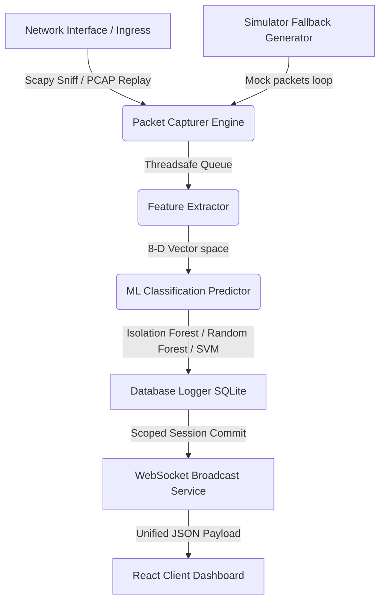

# Network Anomaly Detection System (NADS)

An enterprise-grade, real-time Network Anomaly Detection System built from scratch, utilizing a **FastAPI** backend and a custom **React + TypeScript + Tailwind CSS** frontend. The system performs signature and machine-learning based network classifications, alerts on security hazards, and renders operations inside a high-fidelity glassmorphism dashboard.

---

## Core Pipeline Architecture



---

## Repository Structure

```
network-anomaly-detection-platform/
├── backend/                  # FastAPI Application
│   ├── api/                  # HTTP Router and WebSocket Broadcasters
│   ├── database/             # SQLAlchemy Engine Factories
│   ├── models/               # SQLAlchemy SQL database models
│   ├── schemas/              # Pydantic validation schemas
│   ├── sniffer/              # Thread-safe Scapy packet sniffer & mocks
│   ├── ml/                   # Machine learning model classifiers (joblib/sklearn)
│   ├── reports/              # ReportLab PDF executive compiler
│   ├── utils/                # Telemetry resource meters & config settings
│   ├── tests/                # Unit test specifications
│   └── main.py               # Main application lifespan orchestrator
├── frontend/                 # React client Application
│   ├── src/
│   │   ├── components/       # Virtualized tables, charts, UI controls
│   │   ├── context/          # Persistent WebSocket telemetry streams
│   │   ├── services/         # Axios API connection endpoints
│   │   ├── pages/            # Dashboard, ML telemetry, analytics views
│   │   ├── styles/           # CSS modules and glassmorphism styling
│   │   ├── App.tsx           # Layout shell & toast notifications overlays
│   │   └── main.tsx          # Application loader
│   ├── index.html            # Entry HTML landing page
│   ├── tailwind.config.js    # Styling properties and theme metrics
│   ├── vite.config.ts        # Vite compiler rules
│   └── package.json          # Node dependencies list
└── README.md                 # Documentation
```

---

## Features

- **Live Capture & Emulation**: Seamless packet ingestion using raw sockets, PCAP replaying, or automated simulation mode when running without root privileges.
- **ML Classifications**: Compares Isolation Forest, One-Class SVM, and Random Forest models side-by-side to predict network threat status.
- **WebSocket Streaming**: Single-broadcast channel pushing packets-per-second, protocol breakdown, and threat scores to the UI at configurable speeds.
- **Assessment PDF Compiler**: Generates formatted executive reports detailing active threats, statistics, and remediation plans.
- **Audit Logs**: Central database tracking of system events, sniffer control, and configuration updates.

---

## Installation & Startup

### Backend Setup

1. Navigate to the backend directory and activate the virtual environment:
   ```bash
   cd backend
   source venv/bin/activate
   ```

2. Install dependencies:
   ```bash
   pip install -r requirements.txt  # Or individual packages: fastapi uvicorn scapy pyshark scikit-learn sqlalchemy pydantic pandas reportlab websockets joblib psutil
   ```

3. Run the API service:
   ```bash
   python main.py
   ```
   *The server initializes at `http://localhost:8000`.*

### Frontend Setup

1. Navigate to the frontend directory:
   ```bash
   cd ../frontend
   ```

2. Install the Node packages:
   ```bash
   npm install
   ```

3. Launch the Vite bundler:
   ```bash
   npm run dev
   ```
   *The client dashboard opens at `http://localhost:3000` (or `http://localhost:5173` if occupied).*
